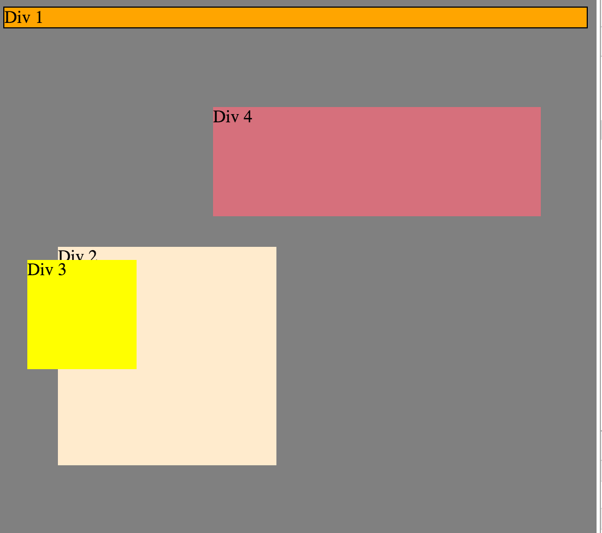

#####How can you use Chrome's DevTools inspector to help you format or position elements?

DevTools allows you to play with details in your formatting, and view them as they are implemented without altering the base code.  Which was quite a bit of fun.

#####How can you resize elements on the DOM using CSS?
By adjusting the height and width elements.
#####What are the differences between absolute, fixed, static, and relative positioning? Which did you find easiest to use? Which was most difficult?
Static is the default setting for position, things are stacked in the order in which they appear in the html. Then comes relative, where you move items around relative to where they would be normally in the code using  top, bottom, left, or right. Then come the two that amuse me the most.

Absolute allows you to remove the object from regular flow and place it anywhere on the screen using positional properties.  The other boxes act like it is no longer there, and you can move it around freely.
Fixed is still a bit fun and odd to me.  It allows you to stick something on the screen that stays in the same position on the screen no matter how the user scrolls.  It also is removed from regular flow, so is ignored by other boxes.
#####What are the differences between margin, border, and padding?
Margin controls the space between the borders of boxes, creating a gap between elements on your screen.  Padding controls the space between the content inside the box and it’s border.  Border is the line (invisible or not) that separates the edges of boxes.

#####What was your impression of this challenge overall? (love, hate, and why?)
Love mostly.  It was great to explore my creative side a bit, and nice to have someone who seemed less fascinated with the endless possibilities of it all to reign me in.