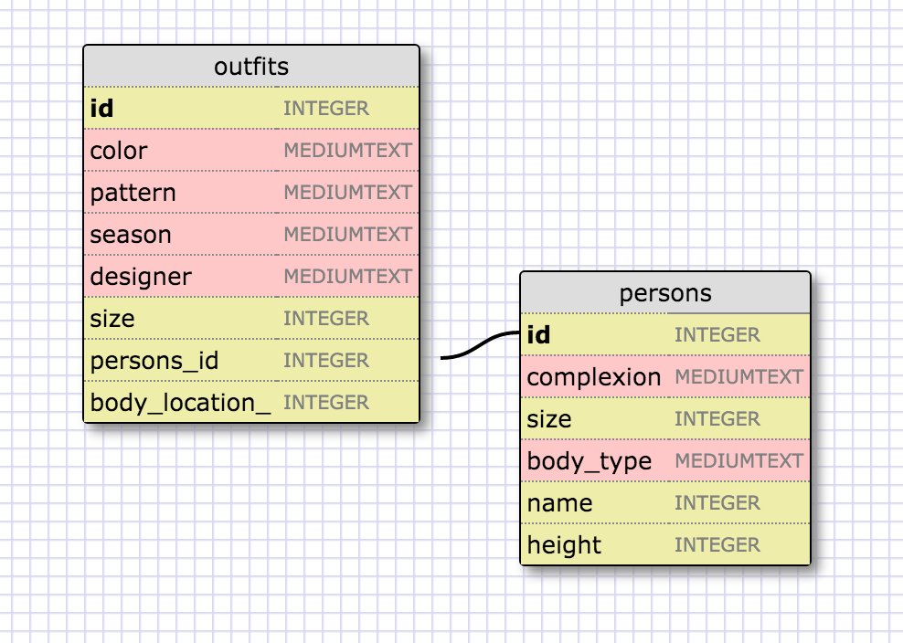

1. SELECT * FROM states;
2. SELECT * FROM regions;
3.SELECT state_name, population FROM states;
4.SELECT state_name, population FROM states
ORDER BY population DESC;
5. SELECT state_name FROM states
WHERE region_id= 7;
6.SELECT state_name, population_density FROM states
   WHERE population_density > 50
    ORDER BY population_density ASC;
7.SELECT state_name FROM states
   WHERE population BETWEEN 1000000 AND 1500000;
8.SELECT state_name, region_id FROM states
    ORDER BY region_id ASC;
9.SELECT region_name FROM regions
   WHERE region_name LIKE '%Central%';
10.SELECT regions.region_name, states.state_name FROM states
    INNER JOIN regions ON states.region_id=regions.id
    ORDER BY states.region_id ASC;

The person to outfit is the one to many relationship.
What are databases for?
They are for storing data in a manner that is easy to search, modify, amend, and analyze.
What is a one-to-many relationship?
It is a method of figuring out if data would be best served by separating out into more than one table.  By using the phrases "__x__ belongs to a __y__. __y__ has many __x__." you can analyze if an object has enough instances of its type to warrent having its own table.
What is a primary key? What is a foreign key? How can you determine which is which?
A primary key and foreign key are two references on separate tables that are the same values.  The primary key would be the y in the previous example, and the foreign key would be the x.  They are used to access values on different tables that are related by the one-to-many relationship.
How can you select information out of a SQL database? What are some general guidelines for that?
You select info from a SQl database using queries. They start out with the SELECT column_name FROM table_name; format and get more complicated from there.
